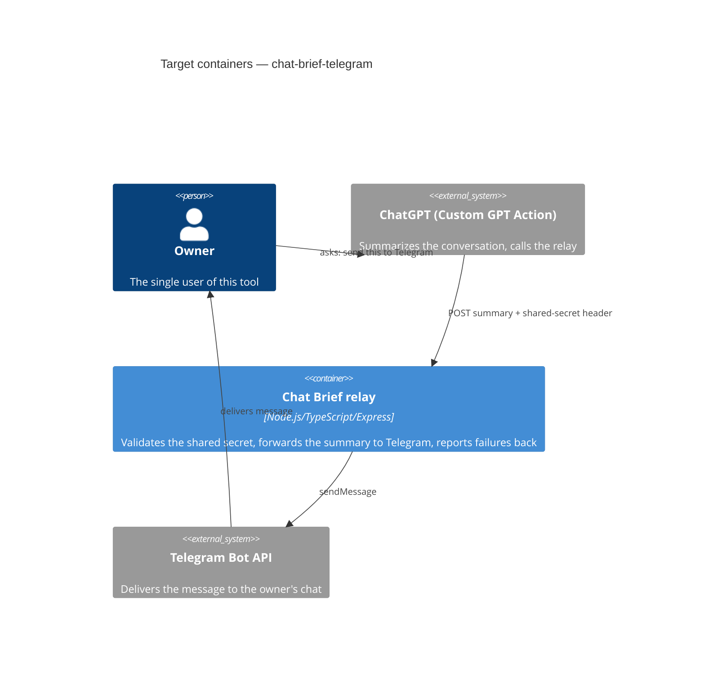

# Architecture map — chat-brief-telegram

> The **target foundation** for this repo (greenfield-bootstrap), fixed with the owner during
> `survey` before anything was scaffolded. `scaffold` materializes this into a real skeleton;
> `specify` / `design` / `implement` read it instead of re-discovering the stack. Refresh with
> `survey` once real code exists and this drifts past `reflects_commit`.

## Stack

- Language / runtime: Node.js 20 + TypeScript 5
- Frameworks: Express (the one HTTP route the relay exposes)
- Build / test / lint: `npm run build` (tsc) / `npm test` (Vitest — unit + one integration test faking the Telegram API) / `npm run lint` (ESLint)

## C4 — target containers

## Module inventory

<!-- No code exists yet — this is the target layout `scaffold` will materialize, not a scan. -->

| Module | Path | Layers | Wired at | Responsibility |
|---|---|---|---|---|
| http | `src/http/` | route handler | `src/index.ts` (planned) | Receives the POST, checks the shared-secret header, calls the relay service |
| relay | `src/relay/` | service | wired from `src/http/` (planned) | Validates the summary is non-empty, calls the Telegram client, shapes the response |
| telegram | `src/telegram/` | infra client | wired from `src/relay/` (planned) | Thin wrapper over Telegram's Bot API `sendMessage` call |
| config | `src/config/` | infra | loaded at boot (planned) | Reads the shared secret, bot token, and chat id from environment variables |

## Conventions (the rules a new feature must match)

- **Module wiring / registration:** the entry point (`src/index.ts`) wires `http -> relay -> telegram` directly — no DI container, no hexagonal ports; this is a 3-layer flat structure sized for one endpoint.
- **Error handling:** every HTTP response (success or failure) uses one JSON envelope, `{ error: "<reason>" }` on failure — so the Custom GPT Action can always parse the outcome the same way, regardless of which layer failed.
- **IDs:** N/A — no persisted entities in v1.
- **Persistence / DB access:** none — see ADR-0002 (no database in v1).
- **Migrations:** N/A — no database.
- **Tests:** unit tests per module (`src/relay`, `src/telegram` validation logic) + one integration test that fakes Telegram's API and drives the full request-to-relay path. Test files live beside their module as `*.test.ts`.
- **Inter-module communication:** direct function calls only — single process, no queues/events.
- **UI / styling:** <!-- N/A: no frontend in v1 -->

## Datastores

| Store | Engine | Accessed via | Notes |
|---|---|---|---|
| — | — | — | None in v1 — see ADR-0002. A DB is an explicit future-scope item only if v1's usage justifies persistence. |

## Frontend / UI foundation

<!-- N/A: no frontend — this is an API-only relay -->

## Where things live / closest precedents

- A new HTTP-facing capability → `src/http/`, modelled on the relay route once it exists.
- Any Telegram-specific logic → `src/telegram/`, kept isolated so the relay service stays testable without hitting the real Telegram API (fake it in tests).

## Constraints & known tech-debt

- Deploys as a small always-on process, not a serverless function — a deliberate choice (ADR-0003) to avoid cold-start timeouts against the Custom GPT Action's ~45s call budget.
- Single hardcoded Telegram chat id and one shared secret, both from environment variables — no per-user config surface; a config change requires a redeploy (named risk in the idea brief, accepted for v1).

## Reconciliation with the authored architecture doc

No authored architecture doc exists yet; this map is the target foundation `scaffold` will build, and becomes the current reference once the skeleton is real.
