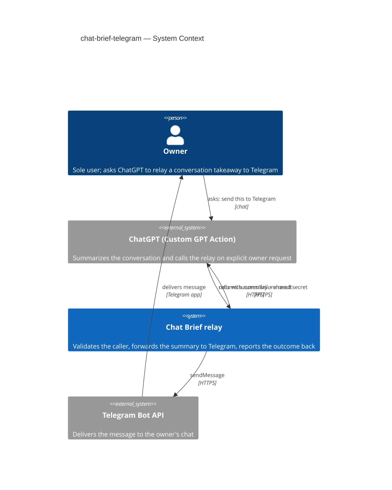
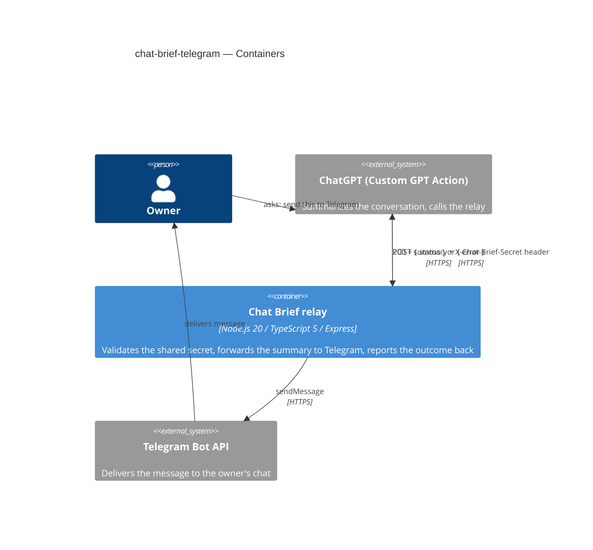
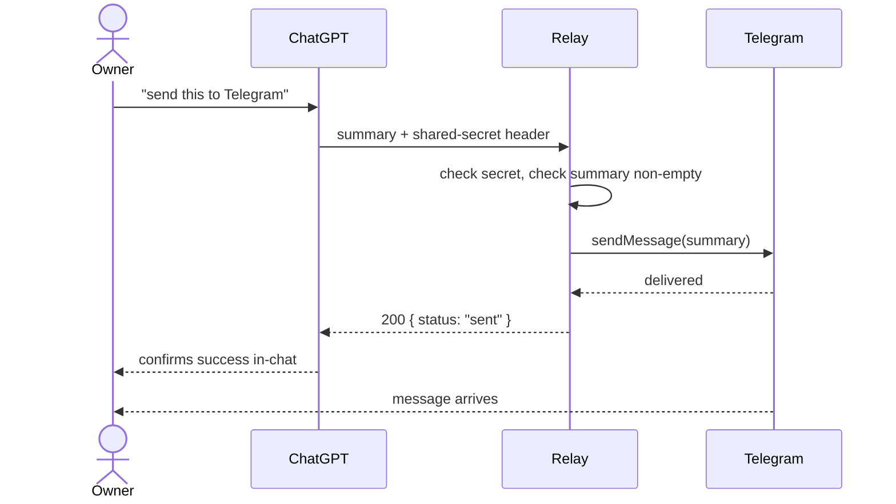
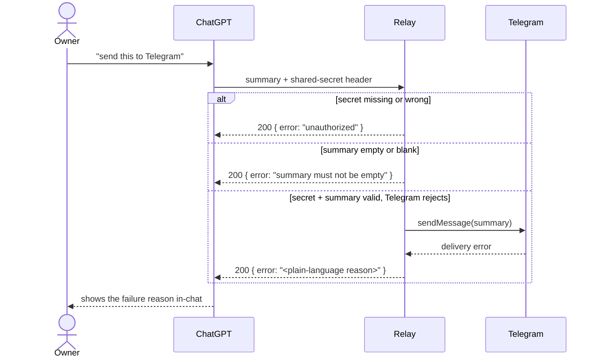
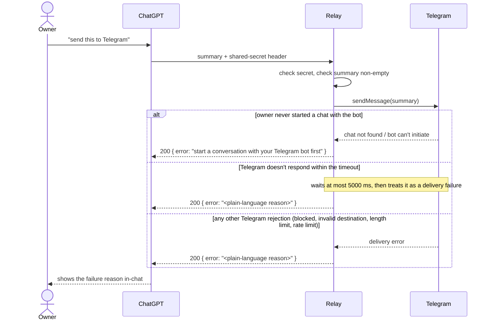

# Software Architecture Document — chat-brief-telegram

## 1. Introduction and goals

**Intent.** Ship a stateless relay so the owner can deliver a ChatGPT conversation's takeaway to
Telegram without leaving the chat or manually copying text, and see the delivery outcome —
success or failure — in the same conversation turn, every time (spec §2).

**Top-3 quality goals (1-liners; full scenarios in §10):**

1. Bounded latency under a hard external round-trip budget (Telegram's own response time).
2. Failure transparency that survives the Custom GPT Action layer, without ever leaking a
   credential.
3. Authorization integrity — every send is gated by the shared secret, with no bypass path.

**Stakeholders.**

| Role | Interest | Sign-off owner? |
|---|---|---|
| Owner | Sole user — triggers sends, reads Telegram, configures the Custom GPT Action | No |
| Custom GPT Action (ChatGPT) | Calls the relay on the owner's explicit request; displays the result | No |
| Tech Lead | SAD approval | Yes |
| Security Lead | Reviews the failure-message code path for credential echoing (spec §6.1) | Yes |

<!-- Decision overrides (¶4) — populated by the critic resolution loop, empty otherwise. -->

## 2. Constraints

**Technical.**
- Node.js 20 + TypeScript 5 (ADR-0001, project-level).
- Express (the one HTTP route the relay exposes).
- No datastore — the relay is stateless (project ADR-0002).
- Flat 3-layer architecture: `src/http/` (route handler) → `src/relay/` (service: validates,
  calls Telegram, shapes the response) → `src/telegram/` (thin Bot API `sendMessage` wrapper);
  `src/config/` reads environment variables. `src/index.ts` wires them directly — no DI container.

**Organisational.**
- No formal deadline — a personal project with no external trigger (spec §1); the owner is the
  sole stakeholder and decision-maker.
- Single-person effort — no team composition to coordinate.

**Conventions.**
- `CLAUDE.md` (repo root) — every HTTP response, success or failure, uses one JSON envelope;
  failure shape `{ "error": "<reason>" }` (ADR-0002 in this feature refines this further: the
  envelope always rides on HTTP 200).
- Tests live beside their module as `*.test.ts`; inter-module communication is direct function
  calls only (no queues/events) — `docs/architecture-map.md`.

**Regulatory / external.**
- No compliance regime applies (single-owner personal tool, spec §6.1 data classification:
  confidential but not regulated PII).
- A security review is required before shipping (spec §6.1) — scoped specifically to the
  failure-message code path, checking no response can echo the shared secret or the Telegram bot
  token.

## 3. Context and scope

The owner uses ChatGPT day-to-day and wants a takeaway from the current conversation to reach
their own Telegram, without leaving the tab or copy-pasting. The relay is the one thing standing
between an explicit, in-conversation request (the Custom GPT Action) and the owner's Telegram —
it authenticates the caller, forwards the summary, and reports the outcome back into the same
conversation turn.

<!-- brownfield: docs/architecture-map.md is the fixed greenfield-bootstrap target foundation;
     the scaffolded skeleton (src/http, src/relay, src/telegram, src/config) already matches it
     exactly — read directly instead of re-scanning. -->

**External systems (in / out):**

| Actor or system | Type | Interaction |
|---|---|---|
| Owner | Person | Asks ChatGPT to send the current takeaway; reads the result in Telegram |
| ChatGPT (Custom GPT Action) | System (external) | Summarizes the conversation on explicit request, calls the relay, displays the outcome back to the owner |
| Telegram Bot API | System (external) | Delivers the message to the owner's chat; the only system the relay authenticates *to* (via the bot token) |

**C4 Context (L1):**



The Context shows the owner asking ChatGPT to relay a takeaway; ChatGPT's Custom GPT Action calls
the relay over HTTPS with the summary and the shared secret; the relay talks to Telegram's Bot API
to deliver the message, then reports success or failure back to the same Action call so the owner
sees it in-chat; Telegram separately delivers the message to the owner's own chat. The trust
boundary is the relay's HTTP entry point: nothing past it is trusted until the shared secret
(ADR-0001) checks out.

## 4. Solution strategy

**Top strategic choices (the seeds for ADRs):**

1. **Single backend-service surface, no UI** — the feature is exactly one HTTP endpoint the
   Custom GPT Action calls; spec's non-goals explicitly rule out any frontend, and the scaffold
   already has one Express route. `target_surfaces: [backend-service]` (frontmatter above).
   No alternative surface exists — the spec forecloses it, so this doesn't reach the blast-radius
   gate despite being foundational.
2. **Authenticate via a custom shared-secret header** — the relay checks a fixed header
   (`X-Chat-Brief-Secret`) against an environment-variable value before doing anything else,
   keeping this credential distinct from the Telegram bot token (CONTEXT.md glossary) and from
   Bearer/OAuth semantics that don't apply to one static, hand-rotated value. → **ADR-0001**.
3. **Always respond HTTP 200; failure keeps CLAUDE.md's exact envelope** — every response,
   success or failure, returns 200; failure is `CLAUDE.md`'s already-fixed `{ "error": "<reason>" }`
   verbatim, success is a minimal `{ "status": "sent" }`, so the Custom GPT Action never has a
   non-2xx path whose body could be discarded before the model sees it — directly satisfying
   AC-02's requirement that a failure reason can't be hidden behind a generic message, with no
   drift from the repo's existing convention. → **ADR-0002**.
4. **Synchronous, in-process integration; no persistence, no cache, no queue** — `http → relay →
   telegram` is a direct function-call chain inside one always-on process (project ADR-0002 no
   database, ADR-0003 always-on). AC-01/AC-02 require the outcome visible in the same conversation
   turn, which forecloses any async/queued path; a handful of sends a week (spec §6) forecloses a
   cache tier. No legitimate alternative given these existing constraints, so this is decided
   inline, not gated to an ADR.

**Assumptions locked in at this depth (`easy`) — decided from existing constraints rather than
walked one-by-one, confirmed as a batch with the owner:**

- The shared secret's *value* is an email-shaped string the owner chooses (distinct from the
  `owner:` frontmatter field already public in this repo), loaded only from an environment
  variable — never hardcoded, never committed. This closes spec §8's first open question
  ("How is the shared secret issued/rotated in practice?"): **issuance/rotation = edit the
  environment variable, redeploy.** No rotation endpoint or vault integration — v1 has no admin
  surface and is single-owner by design (spec non-goals).
- §7 Deployment — N/A, reuses the existing always-on process (project ADR-0003), no new infra.
- §8 Crosscutting conventions (logging, error handling) inherit `CLAUDE.md` / architecture-map
  verbatim — no per-feature override signaled by spec §6.1.

Each tactical decision in later sections traces to one of the four seeds above. No tactical
decision in this SAD contradicts a strategic choice.

## 5. Building block view

Flat 3-layer architecture, no hexagonal ceremony — the existing convention for a single-endpoint
relay (`docs/architecture-map.md`, `CLAUDE.md`). One deployable process; the four folders below are
logical modules within it, wired directly by `src/index.ts` with no DI container.

**Internal decomposition:**

```
src/
├── http/       <Express app + the one route: parses the header, calls relay, returns the envelope>
├── relay/      <service layer: validates the summary is non-empty, calls the Telegram client, shapes the response>
├── telegram/   <thin wrapper over the Bot API's sendMessage call>
└── config/     <reads bot token, chat id, shared secret, port from environment variables>
```

**C4 Container (L2):** one container per declared `target_surface` — a single `backend-service`,
matching `docs/architecture-map.md`'s already-fixed target container view.



The Containers view shows one backend-service container, the relay, sitting between ChatGPT's
Custom GPT Action and Telegram's Bot API: the Action posts the summary with the shared-secret
header, the relay forwards a validated summary to Telegram via `sendMessage`, and the relay always
answers with a 200 carrying `CLAUDE.md`'s JSON envelope (ADR-0002) regardless of outcome. Internally the relay
is the four modules in the folder tree above — `http` parses the request, `relay` validates and
shapes the response, `telegram` talks to the Bot API, `config` supplies all three with their
environment-sourced values.

## 6. Runtime view

**Critical flow 1: happy-path send (AC-01, AC-02)**



Flow 1 — happy path: the owner asks ChatGPT to send the takeaway; the Custom GPT Action calls the
relay with the summary and the shared-secret header; the relay checks the secret and confirms the
summary isn't empty; it calls Telegram's `sendMessage`; on delivery it answers the Action with a
200 and a success body, which ChatGPT shows the owner in the same turn, while Telegram
separately delivers the message to the owner's chat.

**Critical flow 2: denied / rejected call (AC-02, AC-03, AC-04)**



Flow 2 — every non-success path: a wrong or missing secret is denied outright (AC-03) with no
hint about the summary's own validity; an empty or blank summary is rejected (AC-04); a summary
and secret that both pass but that Telegram can't deliver (including the AC-05 case — the owner
never started a chat with their bot — reported with its own distinct wording, every other Telegram
obstacle reported as this same generic failure) all return the same 200 + `{ error: "<reason>" }`
shape — `CLAUDE.md`'s existing envelope verbatim, per ADR-0002 — so the owner always sees the
reason in the same conversation turn, never a silent loss. The `sequences` stage covers the
remaining branch detail (AC-05's distinct wording, Telegram-timeout handling) as its own flows.

**Critical flow 3: Telegram-side delivery outcomes (AC-05)**



Flow 3 — the three ways Telegram itself can fail a delivery, after the secret and summary have
already passed: the owner never started a conversation with their configured bot gets its own
distinct wording (AC-05), so it reads as a one-time setup issue rather than a bug; a call that
doesn't come back within the relay's 5000 ms budget (spec §6 NFR) is treated as a delivery
failure rather than an unbounded wait; any other Telegram-side rejection (blocked bot, invalid
destination, length limits, rate limiting) reports as the same generic failure Flow 2 already
shows. All three still return the 200 + `{ error: "<reason>" }` envelope (ADR-0002), so the owner
sees the reason in the same conversation turn regardless of which of the three fired.

## 7. Deployment view

<!-- N/A: reuses the existing always-on process (project ADR-0003) — this feature adds no new
     infrastructure, replicas, or scaling unit. It's one more route inside the same Node.js
     process the scaffold already deploys. -->

**Monitoring:** none exists in v1 (spec §8 — availability target deferred, no uptime monitoring
tool chosen yet; tracked as an open question below, due before `sdd:tasks`).

## 8. Crosscutting concepts

| Concept | Convention | Where defined |
|---|---|---|
| Logging | Structured; the summary text and the shared secret are never written to logs or error traces in plain form | Spec §6.1; this SAD §2 |
| Authentication | Custom shared-secret header (`X-Chat-Brief-Secret`), checked before any Telegram send | ADR-0001 |
| Response shape | Always HTTP 200; failure is `CLAUDE.md`'s exact envelope `{ "error": "<reason>" }`, success is `{ "status": "sent" }` — the Action tells them apart by whether `error` is present | ADR-0002; `CLAUDE.md` |
| Error handling | Every failure reason is plain-language, never a raw exception or stack trace, and never echoes the shared secret or bot token | Spec §6.1 AC-02 |
| Secret/config sourcing | Bot token, chat id, and shared secret are all read from environment variables only, never hardcoded; an unset/empty shared secret must fail closed, not be treated as valid | Spec §6.1; `src/config/` |
| ID strategy | N/A — no persisted entities (project ADR-0002) | — |
| Internationalisation | N/A — single owner, single language | — |
| Rate limiting | None in v1 — accepted risk (brute-force, flooding) | Spec §6.1 |
| Events | N/A — direct function calls only, no queues/events | `docs/architecture-map.md` |

## 9. Architecture decisions

| # | Title | Status | Section |
|---|---|---|---|
| 0001 | Authenticate via a custom shared-secret header | Accepted | §4 |
| 0002 | Always return HTTP 200 with a result envelope | Accepted | §4 |

ADR files live under `docs/features/chat-brief-telegram/adr/NNNN-<title>.md`.

## 10. Quality requirements

**QG-1. Bounded latency under a hard external round-trip budget**
- **When:** the Custom GPT Action calls the relay with a valid summary and secret.
- **Then:** the relay's own processing plus a normal Telegram round trip stays at p95 ≤ 3000 ms
  (spec §6); the relay waits at most 5000 ms for Telegram's response before treating it as a
  delivery failure (spec §6) — never an unbounded wait.
- **How verify:** integration test timing against a faked Telegram API (both the 3000 ms p95 and
  the 5000 ms hang/timeout case), plus a manual real-world check after deploy.

**QG-2. Failure transparency without credential leakage**
- **When:** the relay does not report success, for any reason — rejected, denied, or delivery
  failure.
- **Then:** the owner sees the failure in the same conversation turn as a plain-language reason
  the Action can display verbatim, and that response never contains the shared secret or the
  Telegram bot token, regardless of which check failed (AC-02, spec §6.1).
- **How verify:** the security review named in spec §6.1 (Security Lead reads every failure-message
  code path specifically for credential echoing) plus the spec §7 KPI — 0 known credential-leak
  instances across all sends in the first 4 weeks, verified by the owner reading every failure
  message that occurs.

**QG-3. Authorization integrity**
- **When:** any caller invokes the relay, with or without the correct shared secret.
- **Then:** a wrong or missing secret is always denied, nothing is sent to Telegram, and the
  denial never reveals whether the summary itself was otherwise valid (AC-03); the relay must
  never treat an unset or empty configured secret as a valid match (spec §6.1).
- **How verify:** unit tests on the `http`/`relay` boundary covering missing header, wrong value,
  and unset-config-value cases; the one integration test that fakes Telegram's API also asserts
  no call reaches Telegram when the secret check fails.

## 11. Risks and technical debt

| Risk / debt | Severity | Mitigation | Owner |
|---|---|---|---|
| Duplicate-send safety — a caller-side retry after the Custom GPT Action's own call timeout is not deduplicated; a retry can double-deliver the same summary | Low | Explicitly accepted, not measured (spec §6); ADR-0003 (project) removes the cold-start-specific cause, but any timeout on the caller's side can still trigger a retry | Owner |
| Brute-forcing the shared secret | Low | No lockout or alerting in v1 — accepted risk (spec §6.1); the secret's email-shaped value is lower-entropy than a random token, which this SAD's §4 assumptions don't change | Owner |
| Prompt injection via pasted content instructing the model to trigger a send | Low | Accepted risk — the relay can't distinguish an owner-intended summary from an injected one (spec §6.1) | Owner |
| Flooding via repeated sends | Low | No rate limiting in v1 — accepted risk (spec §6.1) | Owner |
| Open architectural decision: numeric availability target for v1 | Open question | Resolve before `sdd:tasks`; no uptime monitoring exists yet to check a number against (spec §8, default: no formal SLO, best-effort only) | olatsko@gmail.com |

**Accepted debt (acceptable in v1, plan to fix later):**
- Single hardcoded Telegram chat id and one shared secret, both from environment variables — no
  per-user config surface; a config change requires a redeploy (`docs/architecture-map.md`,
  accepted for v1).
- No event-schema or contract versioning — a single fixed endpoint, no consumers beyond one
  Custom GPT Action; revisit only if a second caller ever appears (out of scope per spec non-goals).

## 12. Glossary

| Term | Meaning |
|---|---|
| Custom GPT Action | The mechanism inside a Custom GPT that lets ChatGPT call this feature's relay mid-conversation, only when the owner explicitly asks. NOT an automatic/background trigger. |
| Shared secret | A fixed value configured in both the Custom GPT Action and the relay, sent as the `X-Chat-Brief-Secret` header on every call and checked before any Telegram send. NOT the Telegram bot token — the bot token authenticates the relay to Telegram; the shared secret authenticates the caller (ChatGPT) to the relay. |
| Result envelope | The JSON shape every relay response uses, always under HTTP 200: `{ "status": "sent" }` on success, `{ "error": "<plain-language reason>" }` — `CLAUDE.md`'s existing failure envelope, unchanged — on any non-success outcome (ADR-0002). |
| Telegram-not-started failure | The one Telegram-side delivery failure given distinct wording (AC-05): the owner has never started a conversation with their configured bot. Every other Telegram obstacle (blocked bot, invalid destination, length limits, rate limiting) reports as the generic failure instead. |
