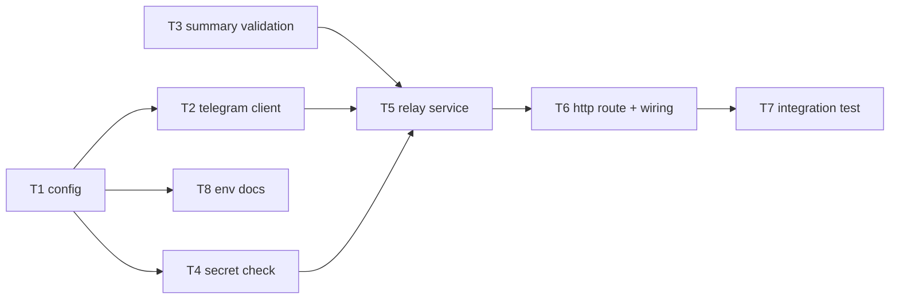

# Epic — chat-brief-telegram

> **Spec:** [spec.md](../spec.md) · **Design:** [sad.md](../sad.md) · **Data model:** [data-model.md](../data-model.md) · **API:** [openapi.yaml](../contracts/openapi.yaml) · **ADRs:** [adr/](../adr/)

## Goal

Ship the relay described in [spec §2](../spec.md): one HTTP endpoint the owner's Custom GPT
Action calls to deliver a conversation takeaway to Telegram, with every outcome — success or
failure — visible in the same conversation turn.

## Scope

- **In:** `src/config/`, `src/telegram/`, `src/relay/`, `src/http/`, `src/index.ts` wiring, one
  integration test, environment-variable documentation.
- **Out (spec §3):** any persistence or send history, a frontend, multi-user/self-serve
  onboarding, a retry/dedup mechanism, message formatting, and authoring the Custom GPT itself.

## Task map

## Tasks

See [tracker.md](./tracker.md) for status. Machine contract: [tasks.json](../tasks.json).

| # | Task | Layer | Blocked by | DoD (short) |
|---|---|---|---|---|
| T1 | Load and validate relay configuration from environment variables | infra | — | Fails closed on a missing/empty shared secret |
| T2 | Implement the Telegram sendMessage client wrapper with a bounded timeout | infra | T1 | Distinguishes delivered / chat-not-started / failed, incl. timeout |
| T3 | Implement summary validation | domain | — | Rejects empty, whitespace-only, non-text |
| T4 | Implement shared-secret authorization check (fail-closed) | domain | T1 | Wrong/missing secret rejected without checking the summary |
| T5 | Implement the relay orchestration service | app | T2, T3, T4 | Every AC-01..05 branch shapes the right envelope |
| T6 | Add the POST /api/v1/send route and wire the modules | ports | T5 | Always 200, matches openapi.yaml, never leaks credentials |
| T7 | Add the end-to-end integration test | tests | T6 | p95 budget, 5000ms timeout, no-call-on-bad-secret |
| T8 | Document the required environment variables | docs | T1 | .env.example / README lists every Config field |

## Risks / Hard rules

- **Never** let a response body contain the shared secret or the Telegram bot token, under any
  failure path, including an unexpected exception ([spec §6.1](../spec.md)) — enforced in
  [T6](./t6-http-route.md)'s DoD.
- **Never** add a retry/dedup mechanism — the duplicate-send risk is an accepted risk
  ([sad.md §11](../sad.md)), not something any task should mitigate.
- The secret check must run **before**, and independently of, the summary check
  ([T4](./t4-secret-check.md), [T5](./t5-relay-service.md)) — AC-03 requires a wrong secret never
  hints at the summary's own validity.
