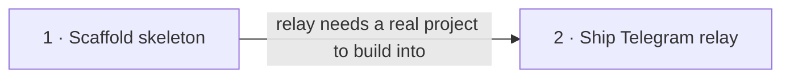

# Roadmap — chat-brief-telegram

> **A decomposition, not a promise.** The overall idea broken into incremental steps: what each
> step is, where it comes from, how big it is — or that nobody has looked at it yet — and in which
> order, and parallel lanes, we walk them. **No dates** (except shipped history), **no scores** —
> order is the prioritization. The *solution* for any step lives in its `docs/features/<slug>/`
> spec, not here.

## Destination

From any live ChatGPT conversation the owner can trigger a short summary delivered securely to their own Telegram, with every delivery outcome visible in that same conversation — and once proven, the same delivery pattern extends to automatically deliver completed Deep Research conclusions.

## Steps

| # | Step | Source | Size | Status |
|---|---|---|:---:|---|
| 1 | Scaffold the project skeleton — Node/TypeScript/Express layout, test harness, CI, ready to build the relay into | `docs/architecture-map.md` (mode: greenfield-bootstrap) | XS | idea |
| 2 | Ship the in-conversation Telegram relay — a Custom GPT Action lets the owner trigger a short summary, delivered to their Telegram behind a shared secret, with delivery failures reported back in-chat | `docs/idea-brief.md` §1 Raw idea, §7 Recommendation | S | idea |
| 3 | Auto-deliver Deep Research conclusions to Telegram → see [Not yet specified](#not-yet-specified) | `docs/idea-brief.md` §5 Out of scope | fog | idea |

## Not yet specified

| Area | What we'd have to learn | Blocks | How it gets sharpened |
|---|---|:---:|---|
| Deep Research → Telegram auto-delivery | Deep Research tasks complete asynchronously with no live conversation turn to hook a Custom GPT Action into — need to learn what trigger mechanism is even available (a webhook ChatGPT can call, a polling job, something else), and what payload/auth shape would carry over from step 2 | 3 | A recon pass once step 2 has shipped and the trigger options for asynchronous ChatGPT events are actually researched |

## Out of scope

- A frontend or database — `docs/idea-brief.md` §5: v1 is intentionally a stateless relay, no UI, no persistence.
- Multi-user / self-serve support — `docs/idea-brief.md` §5: v1 is hardcoded to one owner and one Telegram destination.

## Open decisions

<!-- none open at this decomposition level — the relay feature's own open questions (summary length target, secret rotation, success confirmation) live in docs/idea-brief.md §8 and are the specify stage's job to close, not the roadmap's -->

## Decisions so far

- No database in v1 → [`docs/adr/0002-no-database-in-v1.md`](adr/0002-no-database-in-v1.md)
- Node.js + TypeScript + Express for the relay → [`docs/adr/0001-use-nodejs-typescript-express-for-the-relay.md`](adr/0001-use-nodejs-typescript-express-for-the-relay.md)
- Deploy as a small always-on process, not serverless, to avoid a cold-start double-send failure → [`docs/adr/0003-deploy-as-an-always-on-process.md`](adr/0003-deploy-as-an-always-on-process.md)
- Feature size for step 2 classified S, route quick → [`docs/features/chat-brief-telegram/.size`](features/chat-brief-telegram/.size)

## Dependency graph

## Execution path

| Wave | Steps | Zone per step (why parallel-safe) | Unlocks |
|:---:|---|---|---|
| 1 | 1 | whole repo (new) | 2 |
| 2 | 2 | `src/http`, `src/relay`, `src/telegram` (new) | — |

## Shipped

| Step | Shipped | Link |
|---|---|---|
